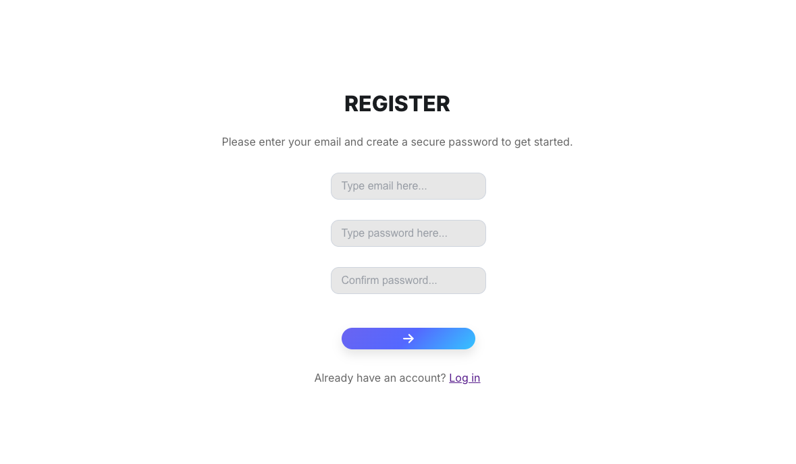
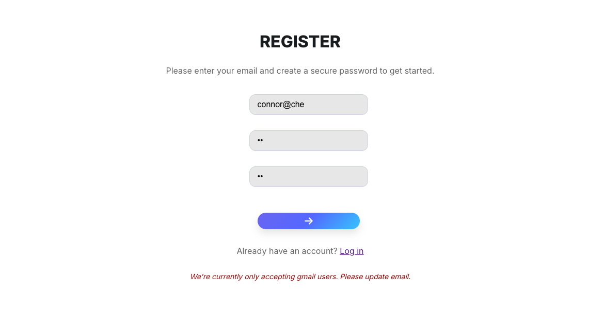
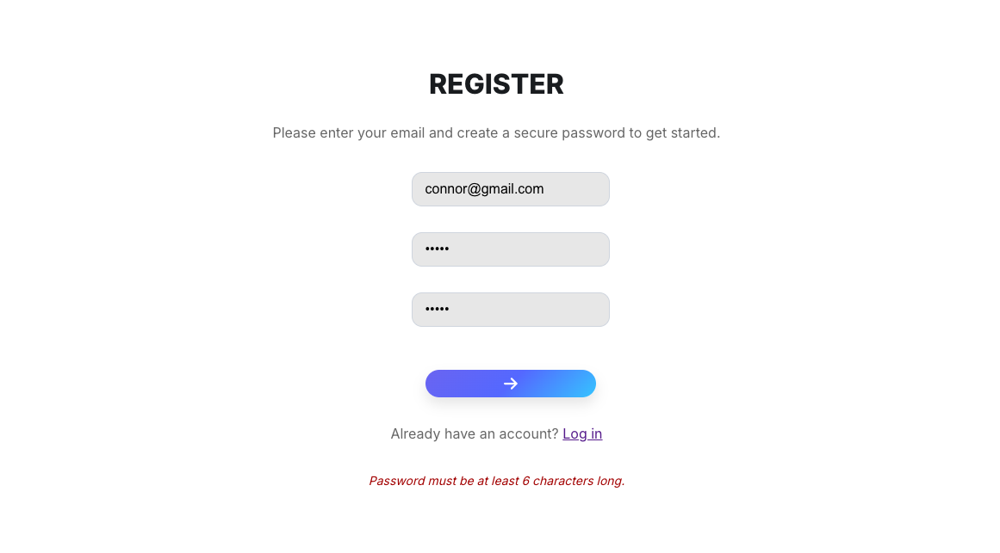
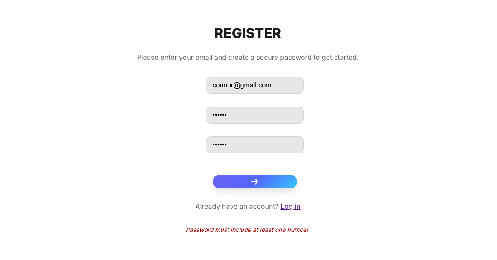
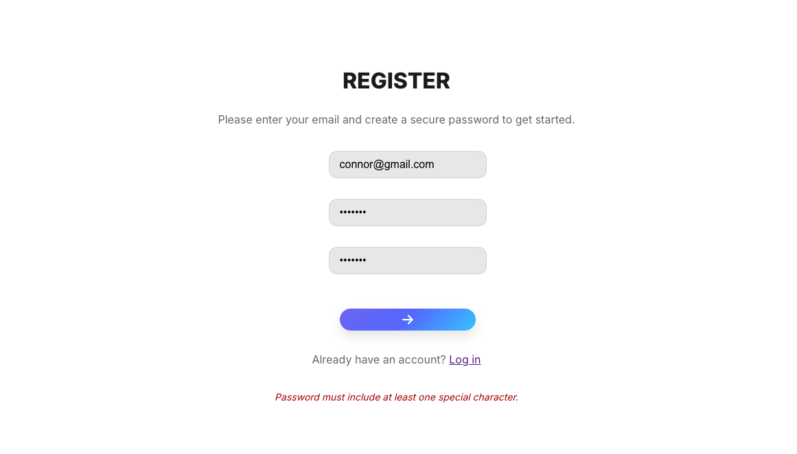

# Full-Stack MERN To-Do Application

Try it here: https://to-do-app-6714.onrender.com/register (to be updated)

## Desktop view













 (fix)

 (to be updated)

This is a to-do

https://github.com/user-attachments/assets/8d9c265f-78dc-428b-a04c-56c24e8d2a49

 application, with a simple / clean user interface. Once registered, and logged-in, users are able to access the to-do app (incl. historic to-do's if this isn't their first time), where they can add, edit, remove, and complete to-do items. The app functionality has been restricted to gmail domains (to practise middleware, nothing against non-gmail users) - therefore, use gmail when registering to get the complete app experience.

## Quick start

Clone the repo.

```
// Install dependencies (in client and server)
npm install

// Run server
npm run dev

//Run client
npm start
```

## Technology

This is a full-stack application, built using:

- React
- Javascript
- JSX
- CSS
- HTML
- MongoDB
- Mongoose
- Node
- Express
- Jsonwebtoken
- Bcrypt
